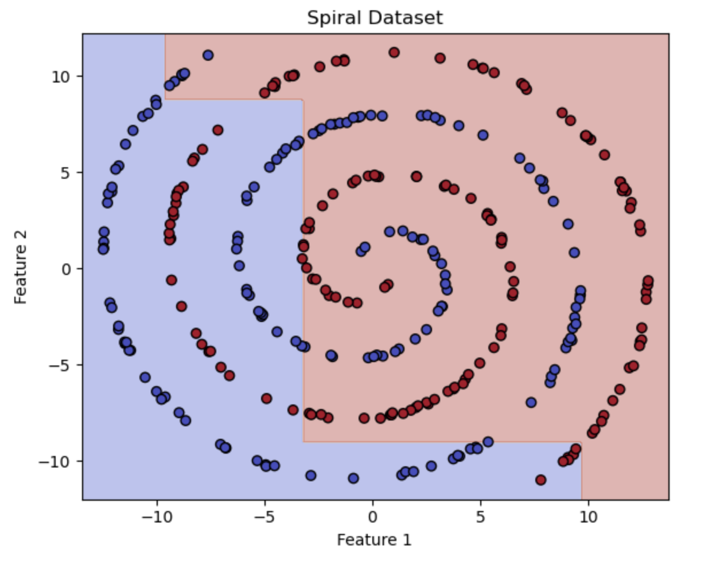
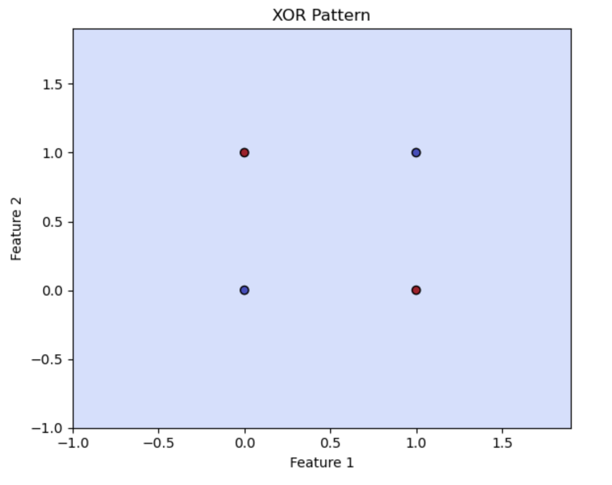
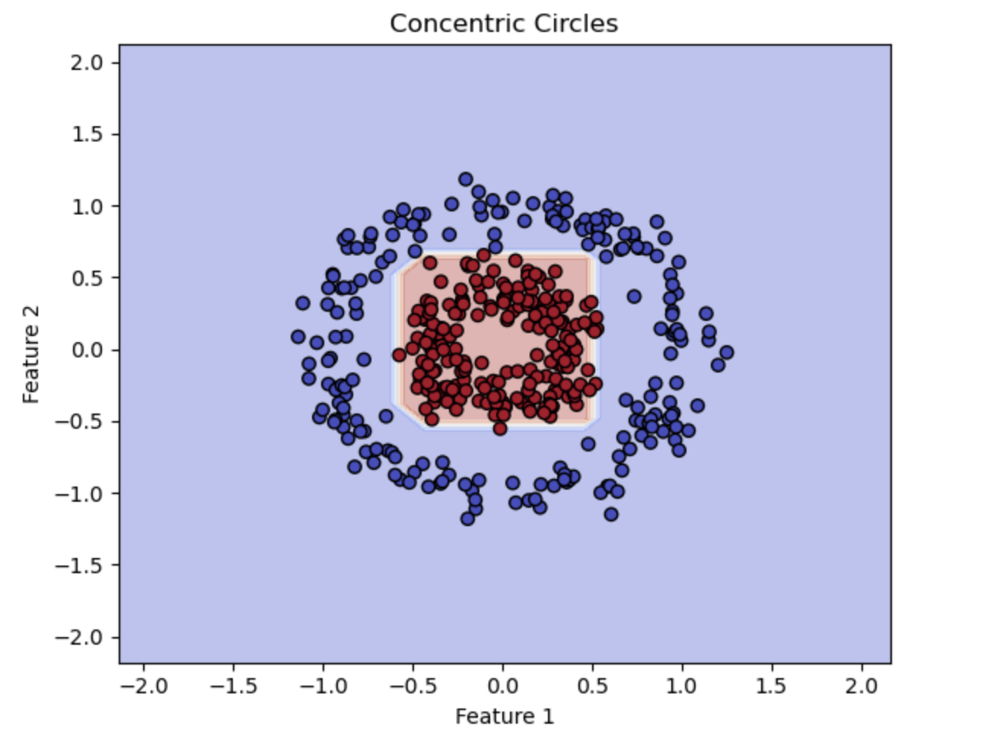
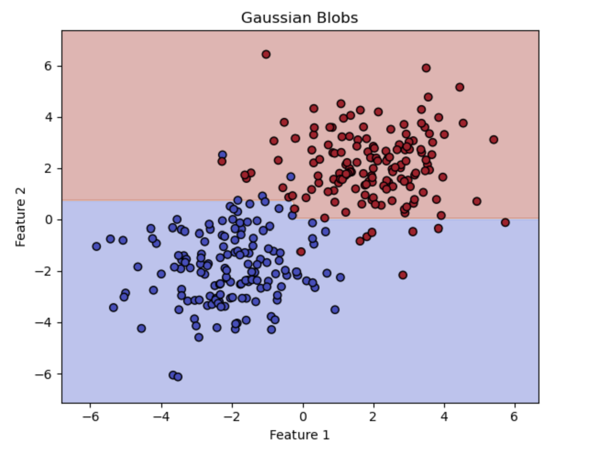
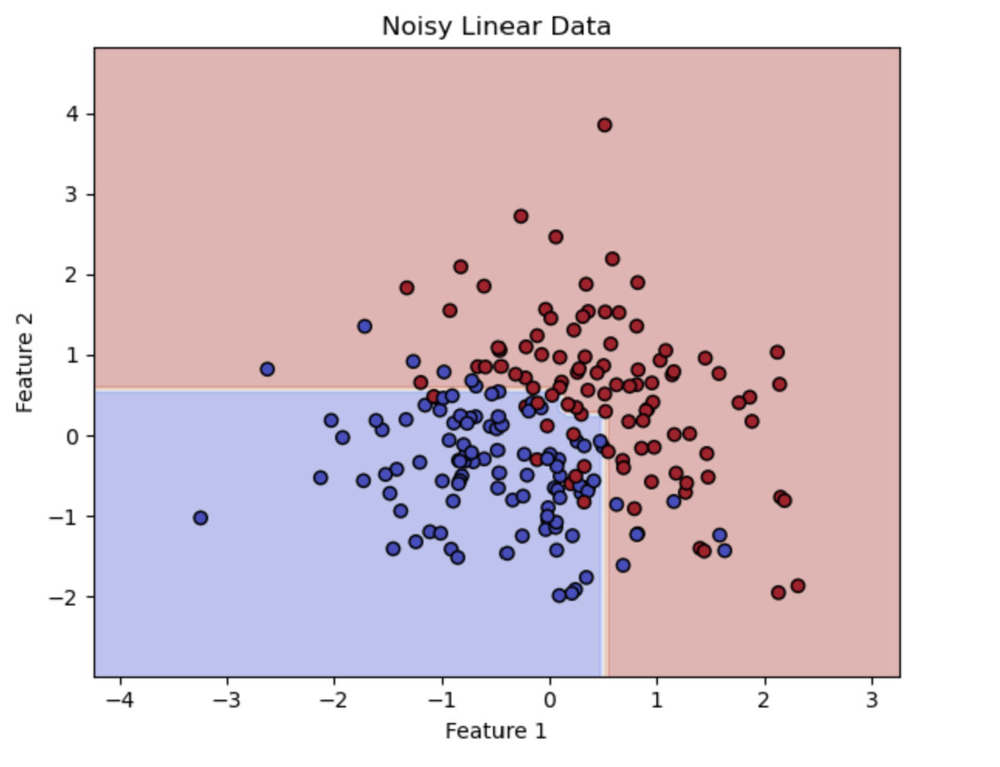
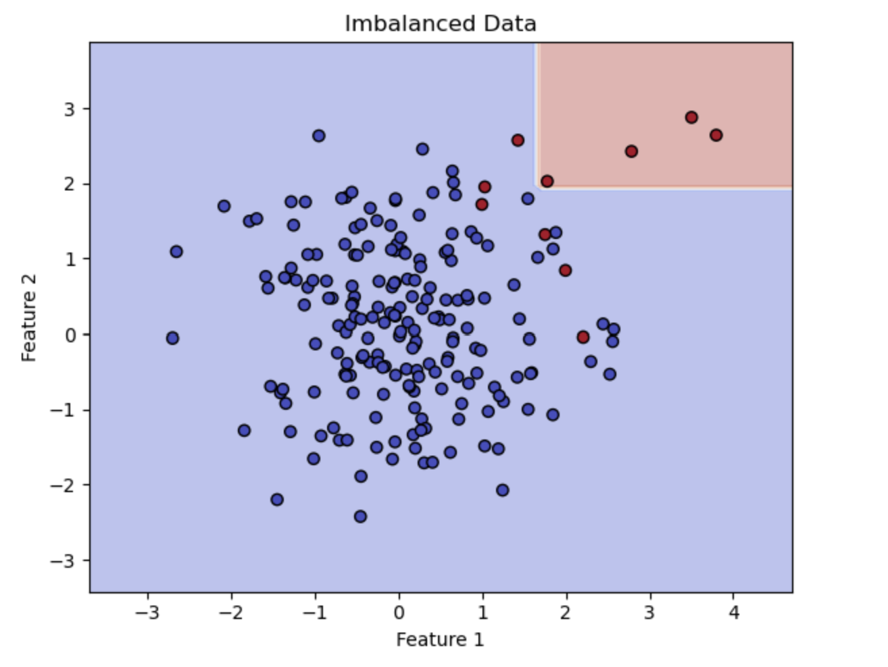
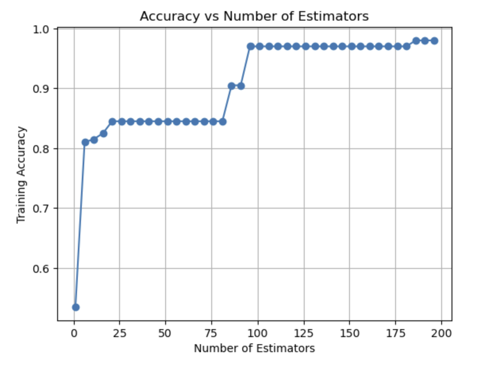
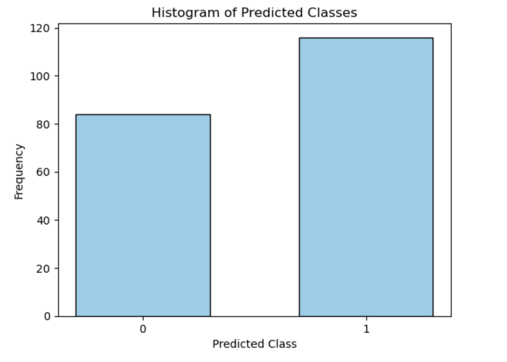
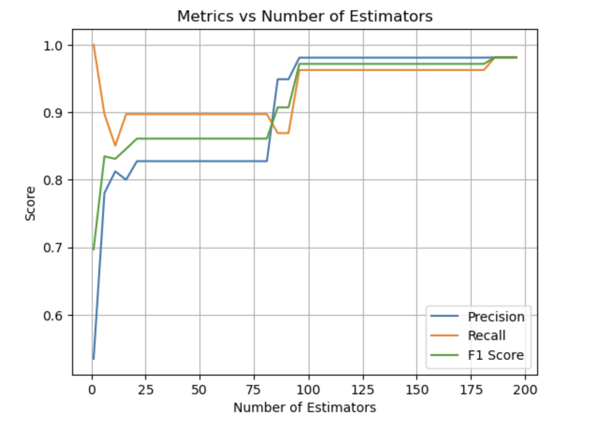

# Project 2: Boosting Trees from Scratch

This project is a full **from-scratch implementation of a Gradient Boosting Tree Classifier**, directly based on Sections **10.9–10.10** of *The Elements of Statistical Learning (2nd Edition)*.

| CWID       | Name                 | email ID                    |
|------------|----------------------|-----------------------------|
| A20593079  | Akshada Ranalkar     | aranalkar@hawk.iit.edu      |
| A20563287  | Anuja Wavdhane       | awavdhane@hawk.iit.edu      |
| A20560966  | Suhasi Gadge         | sgadge@hawk.iit.edu         |
| A20537626  | Vaishnavi Saundankar | vsaundankar@hawk.iit.edu    |
---

##  What does this model do?

This model uses **gradient boosting** to combine a bunch of weak learners (decision stumps) into one strong model for classification. It works by sequentially fitting each new stump to the **residuals (errors)** of the previous stumps, gradually correcting them with each round.

In simpler terms: imagine the model is trying to guess the correct class labels. It starts off pretty bad, but then learns from its mistakes, adds a new stump to fix those mistakes, and repeats this process over and over. Each stump adds a little more knowledge until the final prediction becomes solid.

###  When should it be used?
Use this model when:
- You want to capture complex patterns without using neural networks.
- You're working with **structured/tabular data**.
- You care about performance and interpretability (e.g., which features are important).
- You want a model that balances **bias and variance** nicely by controlling how many stumps are added and how aggressively they learn.

---

##  How did I test if it works?

We tested the model using both **unit tests** and **realistic datasets** that mimic common classification problems. Here's how:

### 1. Unit Tests — `test_cls_boosting.py`
These tests checked:
- Does `.fit()` run without errors?
- Is `.predict()` stable and deterministic?
- Can the model learn from basic linearly separable data?
- Does it handle corner cases like all-zeros or all-ones labels?
- How does it behave with noisy labels or minimal data?

### 2. Dataset-Based Tests — `test_custom_dataset.py`
Here’s where the model faced real-world-like challenges:
- **Spiral dataset**: Swirled data, very non-linear
- **XOR pattern**: Cannot be solved by any single stump
- **Concentric circles**: Forces the model to learn shape, not just value thresholds
- **Gaussian blobs**: Normal clusters with overlapping features
- **Noisy linear data**: Tests robustness to randomness
- **Imbalanced data**: One class heavily outweighs the other

All these tests printed metrics like accuracy, precision, recall, F1-score, and even the confusion matrix. Visualizations were also generated to see how the decision boundaries evolved. That really helped confirm if the model was “getting it” or just guessing.

---

## What can be tuned?

The model exposes the following parameters:

| Parameter       | What it controls                                         | Example                       |
|---------------- |----------------------------------------------------------|-------------------------------|
| `n_estimators`  | How many trees to add (i.e., how deep the learning goes) | `n_estimators=100`            |
| `learning_rate` | How fast each tree corrects the residuals                | `learning_rate=0.1`           |

You can think of `n_estimators` as the number of steps the model takes and `learning_rate` as how big each step is. Larger steps = faster but risky, smaller steps = slow but safe.

---

## What did the model struggle with?

Yes, not everything was perfect. Here's what didn’t work out of the box:

| Problem                     | What happened                            | How I fixed or noted it      |
|----------------------------|-------------------------------------------|------------------------------|
| **Division by zero**       | If the stump predicted all 0s, gamma blew up | I added a `denom != 0` guard |
| **No good stump found**    | On tiny datasets, no split worked         | Fallback to mean predictor   |
| **Imbalanced data**        | The model leaned heavily on the majority class | Noted as a limitation        |
| **High-dimensional noise** | Accuracy dipped when many features were random | Feature selection may help   |

These were really useful for debugging and understanding why real implementations are so robust.

---

##  Visualizations Included

We added several plots to help make the results more tangible:

- **Decision boundaries** for each dataset
- **Accuracy vs number of estimators** (line plot)
- **Precision, recall, F1-score vs estimators**
- **Histogram of predicted classes** (especially for imbalanced data)

You’ll find all of this in `visualize_cls_boosting.ipynb`, cleanly organized with one graph per cell.

---

##  Project Structure

```
BoostingProject/
├── cls_boosting.py              # Main model implementation
├── tests/
│   ├── test_cls_boosting.py     # Unit-level functional tests
│   └── test_custom_dataset.py   # Advanced dataset challenges
├── venv
├── visualize_cls_boosting.ipynb # All plots + decision boundaries
└── README.md                    # This file!
└── requriements.txt
```

---

## ▶️ Example Usage

```python
from cls_boosting import BoostingClassifier
import numpy as np

# Training data
X = np.array([[1], [2], [3], [4], [5]])
y = np.array([0, 0, 1, 1, 1])

# Train the model
model = BoostingClassifier(n_estimators=10, learning_rate=0.1)
model.fit(X, y)

# Predict
preds = model.predict(X)
print(preds)
```

---

## TL;DR

-  Boosting Classifier built from scratch with NumPy
-  Tested on toy + complex datasets
-  Includes visualizations and metrics
-  Tunable via `n_estimators` and `learning_rate`
-  Limitations handled or documented

---
Sure! Below is the updated README with a new section titled **📊 Visualization Results**, where you can paste your decision boundary plots, line graphs, and histograms directly. This is formatted with markdown placeholders so you can easily drop in the figures from your Jupyter notebook (copy-paste the image or use `` format on GitHub).

---

### 📊 Visualization Results

To better understand how the model behaves, we visualized both the **decision boundaries** and **metric trends** during training.

#### 🔸 Decision Boundary Plots

These plots show how the model separates classes across different kinds of datasets:

- **Spiral Dataset**  
  *Highly non-linear, tests model's ability to curve boundaries*
  

- **XOR Pattern**  
  *Logical XOR — not linearly separable*
  

- **Concentric Circles**  
  *Tests whether model can learn circular decision shapes*
  

- **Gaussian Blobs**  
  *Classic clustering with some overlap*
  

- **Noisy Linear Data**  
  *Simple linear separation with added noise*
  
- **Imbalanced Data**  
  *Majority class dominates — good test for bias*
  

---

#### 🔸 Metric Tracking (Training Trends)

These charts show how performance evolves with more trees (boosting rounds):

- **Accuracy vs. Number of Estimators**
  

- **Precision, Recall, F1-Score vs. Estimators**
  

- **Histogram of Predicted Class Labels**
  

---
